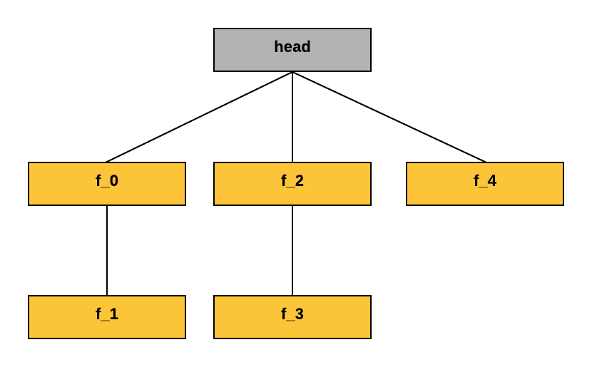
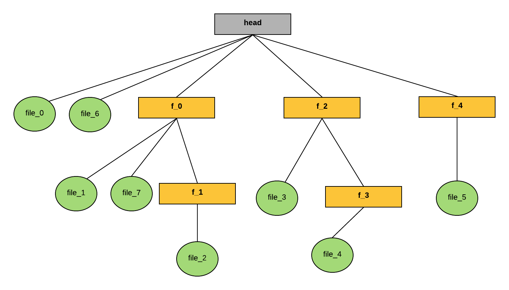

# mirror 0.1

## Introduction

This application is a file hosting service, offering storage and synchronization among clients.
**mirror​** runs a client's code.

* First off, it creates a file in the common directory named after the client's id, like a
sign-up.

* After that, it creates a sub-directory for each
other client under his mirror directory, clones of their own input directory.

* Finally, it monitors the system every now and then, inspecting possible
changes, like new registrations or deletions of users and makes sure the client's mirror directory is always up
to date and in sync with the directories of other users​.

​More details about the functional requirements of this
application can be found in the project’s description/analysis.

## How it works

### Syncing

There are two cases where syncing is required. The first is when a client enters the system and the
second is when a user insertion or deletion is detected while monitoring. In order to update the
mirror directories both for the new user and the one that detected his arrival, each mirror process
forks twice. The first child process is supposed to send files and the second to receive files via
named-pipes using low-level i/o. They both accomplish that sending/receiving folders recursively.
So, before sending a file, a ​ header​ defining whether it is a directory or a file is required. In case of
an error, which would either be an open or read block on a named-pipe for at least 30 seconds or
a directory/file creation type error, a SIGUSR
 signal is sent to the parent process.

### Signals

Three sets of signals might have to get handled during mirror’s operation.

1. SIGALRM  
In this case, the invoking process, a child, either a sender or a receiver, follows the pattern
mentioned a couple of lines above and also ​de-allocates any heap memory​ it might have
been using at the time.

2. SIGINT/SIGQUIT  
mirror ​ is a daemon process, meaning it runs forever, monitoring every now and then and
inspecting new arrivals/deletions. To stop it while managing to ​set all resources and
heap-allocated memory free​, a SIGINT/SIGQUIT handler is defined doing just that.

3. SIGUSR  
In case of a sending error, a SIGUSR1 signal is sent by the sending process to its parent.
Similarly, the receiving process sends a SIGUSR2. A handler is defined in the parent
process, ​incrementing a counter​ indicating the number of times synchronization was
attempted. After three unsuccessful attempts, synchronization is cancelled.

## Input Directories

To make sure mirror is working properly some input directories had to be generated for each user. The
bash script ​ `create_infiles.sh​` does just that. The input directory of a client is passed as an argument. The
number of ​directories​, ​files ​and ​levels​ to distribute those under the input directory are also passed as
parameters. A random name is assigned to each folder/file created. Files are initialized with
random-content using a system program called ​ _fortune​_.

First off, the script creates a chain of directories
iteratively under the input directory. The length of the chain is at most $levels.
If fewer directories than
$levels are left to create the last chain contains that many directories.
For example, creating 5 directories
using 2 levels under an input folder named “head” looks like this.



The number of each folder indicates the order after which they were generated.

After that, directories need to be filled with files. So until we create as many files as
requested we assign one file to each folder, starting from “head”, traversing the
folder-tree using DFS. So, creating 8 files in the system pictured above would result in
a full cycle of 6 assignments, plus 1 more to the “head” and “fold_0”.


The number of each file indicates the order after which they were generated.

`create_infiles.sh` uses /dev/urandom to generate random directory names and the
program ​ _fortune ​_ to initialize files with random content. If those are not supported by
your system use ​ _names.sh_ and _ls_ will be used instead.
`names.sh​` generates random strings of any length requested using an environmental
variable called RANDOM.

For example the following command

    mirror/scripts $  ./create_infiles.sh head 10 4 2

creates 4 directories filled with
10 regular files initialized with random content
in range [64-128]KB under directory 'head'

## Statistics

After a successful transfer, both the sender and the receiver write
a message in the log file of the client. Each client
has a unique log file so these processes need to be synchronized,
using flock system call to make sure they are not both
writing into the file at the same time.
Bash script ​ `get_stats.sh​` is used to get statistics from those log files.
This script reads from stdin and supports the following format:
id code (bytes) ... where:

● **id​** is a positive integer, a client’s identifier  
● **code​** can be assigned `s`(end), `r`(eceive) or `a`(bort)  
● **bytes​** is the number of bytes send or received, depending on the code
  
After iterating on the data it prints in stdout

1. a sorted id list, containing unique client ids
2. the maximum and minimum values of those ids
3. how many bytes and files were sent/received.
4. it displays the number of clients that left the system(code `a`).

## Testing

In this project, there are three main points we need to test.

1. What happens when a client requests from another to get synchronized but he does not respond.
   To find out, run

   ```bash
   mirror/src $ ./​fake_user.sh
   ```

2. What happens when the other client responds and
3. What happens when a client leaves the system.

To test the last two, run ​ `src/new_user.sh`
in a terminal window and then run `src/​_run_user41.sh` in another.
The new user will be detected and get synchronized with the other user.
When user 41 leaves the system, the sub-directory containing his input that was created
under the other client’s mirror directory will be deleted.
Commands like ‘tree’ or ‘diff -sr’ are run towards the end of the first script to verify just that.

## Putting it all together

A script that connects all components of this project can be found under the ​ _scripts ​_ directory and is called
`testing.​sh` Yeah, that was obvious.
So, this script gets one argument which is the number of users involved in
the simulation. It creates a folder named ​ _dbox ​_ and under this folder,
it creates the following directories:  

**common​**  
This is where each user is registered, creating a file name after his id, ending with ‘.id’.

**inputs​**  
Containing an input directory for each user, containing 5 files distributed in 3 folders, 2
levels deep using the ​ `create_infiles.sh` script.

**mirrors**  
Containing a mirror directory for each user.

**logs​**  
Containing all log files. One for each user​.

**trash​**  
This is where mirror’s output is redirected. There will be one file for each user, containing
mirror’s messages generated during the simulation.

After that, it runs a mirror process for each client and sleeps for a while,
so that they get in sync.
Then, it sends a SIGINT signal to
all mirror processes in the system, so that they get to terminate normally.
Finally, it concatenates all log files
and uses ​ `get_stats.sh​` to print the simulation’s statistics in a file called ‘stats’ under dbox directory.

## Epilogue

All source files are very well commented and each critical code section is explained in detail. Therefore, here, I
just tried to emphasize on the main idea, so that we can get a generic, high-level look on the project.
Hopefully, I made things clear.
Thank you.
